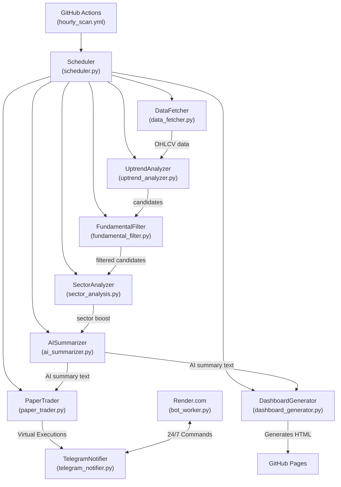

# Detailed Technical Guide -- Institutional-Grade NSE Stock Screener & Auto-Trader

> **Purpose** -- This document explains every component of the automated stock-screening and virtual auto-trading system. It details how the modules interact, how to tune the logic, and how to operate the pipeline locally and in the cloud.

---

## 1. High-Level Architecture



---

## 2. Core Modules -- What They Do

| Module | Purpose |
|--------|---------|
| **`config_manager.py`** | Loads `config.json`, provides easy property accessors for filters and schedules. Guarantees API keys are not committed (git-ignored). |
| **`data_fetcher.py`** | Pulls daily OHLCV data for all NSE symbols. Has a built-in fallback to `yfinance` if the primary NSE fetcher gets IP-blocked by the exchange. |
| **`uptrend_analyzer.py`** | Implements the primary technical quantitative filters (SMA, RSI, ADX, Weekly SMA, Slope) and computes the smart ATR/Volume-Profile stop-loss. |
| **`fundamental_filter.py`** | Retrieves EPS, revenue growth, debt-to-equity, and market-cap via `yfinance`. Caches results in `fundamental_cache.json` for 7 days to speed up scans. |
| **`sector_analysis.py`** | Ranks sectors by aggregate momentum and applies a 1.2x slope boost to stocks in the top 3 hottest sectors. |
| **`ai_summarizer.py`** | Calls Google Gemini API to transform raw technical/fundamental data into a concise, human-readable paragraph for each candidate. |
| **`paper_trader.py`** | The Automated Execution Engine. Manages a virtual ₹500,000 balance, executes pullback entries (1% risk sizing), targets 1.5x Risk/Reward, handles 50% partial exits, and trails stops. |
| **`dashboard_generator.py`** | Generates a static HTML dashboard from the JSON snapshot outputs, which is then served via GitHub Pages for easy visual review. |
| **`telegram_notifier.py`** | Formats AI summaries, virtual trade executions, and market health into Markdown messages and sends them via the Telegram Bot API. |
| **`scheduler.py`** | Orchestrates everything. Parses command-line flags (`--full`, `--hourly`, `--weekly`) and calls the modules in the correct sequence. |
| **`bot_worker.py`** | A lightweight HTTP keep-alive server that runs the Telegram polling loop. Meant to be deployed on Render.com for 24/7 command access. |

---

## 3. The 6-Layer Quantitative Filter

Every stock in the NSE universe must pass through a ruthless obstacle course to become a candidate:

1. **Trend Check (SMA):** The stock's current price must be > 50-day SMA, and 50-day SMA must be > 200-day SMA (Golden Cross structure).
2. **Volume Check:** Today's trading volume must be >= the 20-day average volume (institutional buying).
3. **Momentum Check (RSI):** The 14-period RSI must be between 40 and 65. This ensures we are catching pullbacks, not buying over-extended tops.
4. **Strength Check (ADX):** The 14-period ADX must be > 25 (strong directional trend).
5. **Multi-Timeframe Alignment:** The stock must also be in a confirmed uptrend on the weekly chart (weekly price > weekly SMA-50).
6. **Fundamental Quality Gate:** Positive EPS, Revenue growth >= 5%, and Debt-to-Equity <= 1.5.

If a stock survives all 6 layers, it is scored, sent to Gemini for an AI summary, and pushed to the Dashboard.

---

## 4. The Automated Paper Trading Engine

The `paper_trader.py` module turns the screener into an active algotrading simulator operating on a `virtual_portfolio.json` database.

- **Capital & Risk:** It starts with a virtual balance of ₹500,000. It strictly limits risk to **1% of total capital** per trade.
- **Auto-Buy Logic:** When the screener finds a stock with a high Composite Buy Score (>60) and its RSI is in the pullback zone (40-55), the engine automatically calculates the exact quantity of shares to buy based on the stop-loss distance.
- **Target & Partial Exits:** It automatically calculates a take-profit target at 1.5x the risk distance. If the price hits the target, it instantly auto-sells 50% of the shares to lock in profit.
- **Trailing Stops:** The remaining 50% of shares have their stop-loss trailed automatically using a 1.5x ATR buffer.

You can monitor and reset the Paper Trader at any time using Telegram commands (`/vportfolio`, `/vhistory`, `/vreset`).

---

## 5. Configuration & Tuning (`config.json`)

The system behavior is controlled by `config.json` (which you must create locally, as it is in `.gitignore`). 

```json
{
  "telegram_bot_token": "<your-bot-token>",
  "telegram_chat_id": "<your-chat-id>",
  "gemini_api_key": "<your-gemini-key>",
  "schedule": {
    "hourly_enabled": true
  },
  "filters": {
    "sma_short": 50,
    "sma_long": 200,
    "rsi_min": 40,
    "rsi_max": 65,
    "adx_min": 25,
    "volume_ratio_min": 1.0,
    "atr_stop_loss_multiplier": 1.5,
    "lookback_days": 90
  }
}
```

### Tuning Guide
| Goal | Change in config.json |
|---|---|
| Want more trades? | Lower `"adx_min"` to 20. Widen `"rsi_max"` to 70. |
| Want stricter fundamental filtering? | Raise `"min_revenue_growth"` to 0.10. Lower `"max_debt_equity"` to 1.0. |
| Want tighter risk management? | Lower `"atr_stop_loss_multiplier"` to 1.0. |

---

## 6. Cloud Automation & Deployment

### GitHub Actions (The Heavy Lifter)
The `.github/workflows/hourly_scan.yml` file automates the execution of the pipeline.
- **Full Daily Scan (`--full`):** Runs at 8:00 AM IST (Monday-Friday) to calculate all indicators, stop-losses, and fundamental caches.
- **Hourly Scan (`--hourly`):** Runs between 9 AM and 4 PM IST to monitor current portfolio positions, trail stops, and detect new intraday entries.

*Note: The GitHub Action uses `git add -f` to forcefully commit `virtual_portfolio.json` and `fundamental_cache.json` so the state persists across serverless runs.*

### Render.com (The 24/7 Telegram Listener)
To allow you to issue commands (like `/chart` or `/vportfolio`) at any time, `bot_worker.py` must run 24/7.
1. Deploy this repository as a **Web Service** on Render.com.
2. Set the Start Command to: `python stocks_monitoring_and_notifying/bot_worker.py`
3. Add your API keys as Environment Variables.
4. Set up a free ping on UptimeRobot to hit your Render URL every 5 minutes to prevent the free tier from sleeping.

---

## 7. Running Locally

You can run the engine on your own machine for testing or manual overrides.

```bash
# Activate your virtual environment first
.venv\Scripts\activate

# Run the full daily scan
python stocks_monitoring_and_notifying/scheduler.py --full

# Run the intraday update
python stocks_monitoring_and_notifying/scheduler.py --hourly
```

If you see errors about "Gemini Model not found", run `python stocks_monitoring_and_notifying/test_ai.py` to diagnose which Google Gemini models are currently active on your API key, and update `ai_summarizer.py` accordingly.
