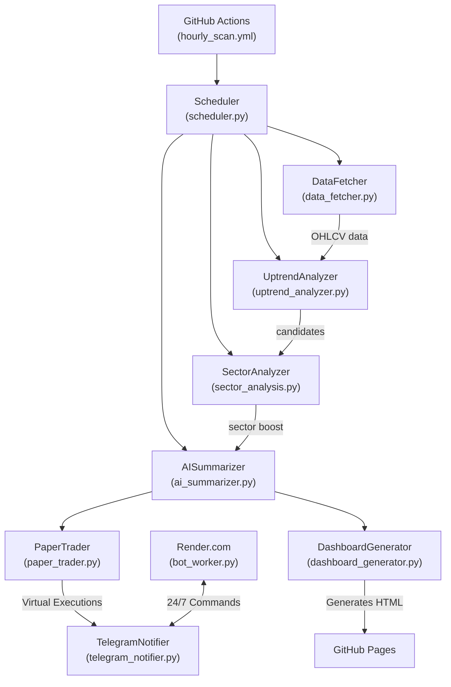

# Detailed Walkthrough -- Institutional-Grade NSE Stock Screener & Auto-Trader

> **Purpose** -- This document explains every component of your automated stock-screening system, the AI Dashboard, the 24/7 Telegram Bot, and the fully Automated Paper Trading Engine. It is written in plain language with code snippets, file locations, and step-by-step instructions so you can maintain or extend the system.

---

## 1. High-Level Architecture

---

## 2. Core Modules -- What They Do & Where They Live

| Module | File | Key Responsibilities |
|--------|------|-----------------------|
| **Scheduler** | `scheduler.py` | Orchestrates the hourly/daily scans and integrates all sub-modules. |
| **DataFetcher** | `data_fetcher.py` | Fetches OHLCV via NSE. Includes a **YFinance fallback** if NSE blocks the IP. |
| **UptrendAnalyzer** | `uptrend_analyzer.py` | 6-layer filter (SMA, RSI, ADX, Slope) & Smart Stop-Loss (ATR/Volume Profile). |
| **SectorAnalyzer** | `sector_analysis.py` | Ranks sectors by strength and applies a momentum boost to stocks in hot sectors. |
| **AISummarizer** | `ai_summarizer.py` | Google Gemini AI evaluates the setup and provides a human-readable summary. |
| **DashboardGenerator** | `dashboard_generator.py` | Creates a beautiful, dynamic HTML dashboard (`index.html`) published to GitHub Pages. |
| **PaperTrader** | `paper_trader.py` | The Algorithmic Engine! Manages 1% risk position sizing, 1.5x R:R targets, and trailing stops in `virtual_portfolio.json`. |
| **TelegramNotifier** | `telegram_notifier.py` | Formats and sends alerts via the Bot API. |
| **BotWorker** | `bot_worker.py` | A 24/7 keep-alive server deployed on Render to listen for Telegram commands `/chart`, `/vportfolio`, etc. |

---

## 3. How It Picks Stocks (The 6-Layer Filter + AI)

1. **Trend Check:** Price > 50 SMA > 200 SMA.
2. **Volume Check:** Today's volume >= 20-day average.
3. **Momentum (RSI):** 14-period RSI must be between 40 and 65 (pullback zone).
4. **Strength (ADX):** 14-period ADX > 25 (strong trend).
5. **Multi-Timeframe:** Weekly price > Weekly 50 SMA.
6. **Sector Boost:** If the stock belongs to a top 3 hot sector, its slope momentum gets a 1.2x multiplier.

If a stock survives, it gets an **AI Summary** via Gemini and is added to the Dashboard.

---

## 4. The Automated Paper Trading Engine

Instead of just alerting you, the system now **trades virtually** using `paper_trader.py`.

### Trading Rules:
- **Capital:** Starts with ₹500,000 in `virtual_portfolio.json`.
- **Pullback Entry:** Only auto-buys if the Buy Score is > 60 and RSI is in the 40-55 pullback sweet spot.
- **1% Risk Sizing:** Calculates `Qty = (Capital * 1%) / (Entry - SL)`. You never lose more than 1% of your account if the stop is hit.
- **1.5 Target (Partial Exit):** Automatically calculates a take-profit target at 1.5x the risk. When hit, it **sells 50%** and moves the stop-loss to breakeven.
- **Trailing Stop:** Uses ATR to trail the remaining 50% for maximum ride.

You can monitor this 24/7 on Telegram using the `/vportfolio` and `/vhistory` commands!

---

## 5. The AI Dashboard

Located at: `https://<your-username>.github.io/Stock_screener/stocks_monitoring_and_notifying/docs/`

Every time the GitHub Action runs, it builds a static, beautiful HTML dashboard with:
- **Market Health Status** (Nifty trend)
- **Composite Buy Score Sorting** (Best First)
- Tabbed views for Entries, Exits, and Virtual Portfolio Holdings.

---

## 6. The 24/7 Telegram Bot (Render.com)

GitHub Actions runs the heavy scans, but a free **Render.com Web Service** (`bot_worker.py`) keeps your Telegram Bot awake 24/7.

**Available Commands:**
- `/start` or `/help` - Show menu
- `/status` - Market health
- `/chart RELIANCE` - Get a technical chart image instantly
- `/vportfolio` - View virtual holdings and cash
- `/vhistory` - View last 10 closed paper trades
- `/vreset` - Reset virtual balance to ₹500,000
- `/watch` / `/unwatch` - Manage special watchlists

*Note: UptimeRobot is used to ping the Render URL every 5 minutes to prevent the free tier from sleeping.*

---

## 7. Cloud Automation (GitHub Actions)

The file `.github/workflows/hourly_scan.yml` runs the scheduler automatically.

| Cron (UTC) | Mode | What runs | IST equivalent |
|------------|------|-----------|----------------|
| `30 2 * * 1-5` | `--full` | Full daily scan | 8:00 AM IST |
| `30 3-10 * * 1-5` | `--hourly` | Hourly refresh | 9 AM - 4 PM IST |

*The workflow uses `|| true` on individual `git add` commands to ensure the dashboard (`index.html`) always pushes successfully, even if snapshot files are missing.*

---

## 8. Tuning & Configuration (`config.json`)

**Never commit this file** (ignored by `.gitignore`).

You can tweak the engine's strictness easily:
- Lower the ADX bar: `"adx_min": 20`
- Tighter stop-loss: `"atr_stop_loss_multiplier": 1.0`
- Earlier trailing stop: `"trailing_stop_activation_pct": 3.0`

---

## Final Thoughts

This system is a **complete quantitative trading pipeline**. It scrapes data, filters for institutional uptrends, applies a smart pullback strategy, dynamically sizes risk at 1%, takes partial profits, hosts an AI dashboard, and talks to you 24/7 on Telegram. 

Happy Auto-Trading!
