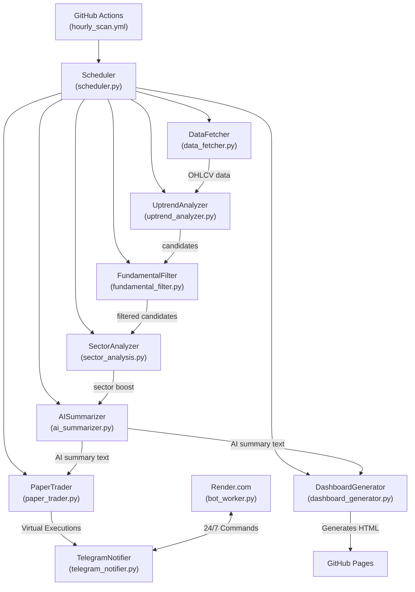

# Detailed Walkthrough -- Institutional-Grade NSE Stock Screener & Auto-Trader

> **Purpose** -- This document explains every component of your automated stock-screening system, how they interact, how to configure/tune them, and how to operate the whole pipeline (local development, back-testing, and production on GitHub Actions). It is written in plain language with code snippets, file locations, and step-by-step instructions so you can maintain or extend the system without digging through the code.

---

## 1. High-Level Architecture



*All Python files live under* `stocks_monitoring_and_notifying/` *inside your repository.*

---

## 2. Core Modules -- What They Do & Where They Live

| Module | File | Key Responsibilities |
|--------|------|-----------------------|
| **ConfigManager** | `config_manager.py` | Loads `config.json`, provides easy `filters`, `schedule`, `portfolio`, and `advanced` property accessors. Guarantees API keys are **not** committed (`.gitignore`). |
| **DataFetcher** | `data_fetcher.py` | Pulls daily OHLCV data for all NSE symbols. Has a built-in fallback to `yfinance` if the primary NSE fetcher gets IP-blocked by the exchange. |
| **UptrendAnalyzer** | `uptrend_analyzer.py` | Implements the 6-layer filter (SMA, Volume, RSI, ADX, Weekly SMA, Slope) and computes the *smart stop-loss* (ATR vs Volume-Profile). Returns a sorted list of candidate dicts. |
| **FundamentalFilter** | `fundamental_filter.py` | Retrieves EPS, revenue growth, debt-to-equity, market-cap, sector via `yfinance`. Results are cached in `fundamental_cache.json` for **7 days** (weekly refresh). |
| **SectorAnalyzer** | `sector_analysis.py` | Ranks sectors by aggregate momentum and applies a 1.2x slope boost to stocks in the top 3 hottest sectors. |
| **AISummarizer** | `ai_summarizer.py` | Calls **Google Gemini** to transform raw technical/fundamental data into a concise, human-readable paragraph. |
| **PaperTrader** | `paper_trader.py` | The Automated Execution Engine. Manages a virtual ₹500,000 balance, executes pullback entries (1% risk sizing), targets 1.5x Risk/Reward, handles 50% partial exits, and trails stops. |
| **DashboardGenerator** | `dashboard_generator.py` | Generates a static HTML dashboard from the JSON snapshot outputs, which is then served via GitHub Pages for easy visual review. |
| **TelegramNotifier** | `telegram_notifier.py` | Formats AI summaries, virtual trade executions, and market health into Markdown messages and sends them via the Telegram Bot API. |
| **Scheduler** | `scheduler.py` | Orchestrates everything. Parses command-line flags (`--full`, `--hourly`, `--weekly`) and calls the modules in the correct order. |
| **BotWorker** | `bot_worker.py` | A lightweight HTTP keep-alive server that runs the Telegram polling loop. Meant to be deployed on Render.com for 24/7 command access. |

---

## 3. How It Picks Stocks (The 6-Layer Filter)

Every single stock in the 5,000+ NSE universe must pass through a ruthless **6-layer obstacle course**. If a stock fails even one layer, it is discarded.

### Layer 1 -- Trend Check (SMA)
The stock's current price must be **above** its 50-day Simple Moving Average (SMA), and the 50-day SMA must be **above** the 200-day SMA.
> *Translation: The stock must be in a confirmed, long-term uptrend (a "Golden Cross" structure).*

### Layer 2 -- Volume Check
Today's trading volume must be **greater than or equal to** the 20-day average volume (controlled by `volume_ratio_min` in config).
> *Translation: Big institutions are actively buying this stock, not just retail noise.*

### Layer 3 -- Momentum Check (RSI)
The 14-period RSI must be **between 40 and 65** (controlled by `rsi_min` and `rsi_max`).
> *Translation: The stock is moving up with good energy, but it is not "overbought" yet -- there is still room to run.*

### Layer 4 -- Strength Check (ADX)
The 14-period ADX must be **above 25** (controlled by `adx_min`).
> *Translation: The uptrend is strong and directional, not just a weak, sideways drift.*

### Layer 5 -- Multi-Timeframe Alignment
The stock must **also** be in a confirmed uptrend on the **weekly** chart (weekly price above weekly SMA-50).
> *Translation: We are not getting tricked by a short-term daily fakeout. The weekly trend confirms it.*

### Layer 6 -- Fundamental Quality Gate
The company behind the stock must be financially healthy:
- **Positive EPS** (the company actually makes money).
- **Revenue growth >= 5%** (controlled by `min_revenue_growth`).
- **Debt-to-Equity <= 1.5** (controlled by `max_debt_equity`).

If a stock survives all 6 layers, it is scored, passed to the AI Summarizer, pushed to the Dashboard, and reviewed by the Paper Trader!

---

## 4. The Automated Paper Trading Engine

The `paper_trader.py` module turns the screener into an active algotrading simulator operating on a `virtual_portfolio.json` database.

- **Capital & Risk:** It starts with a virtual balance of ₹500,000. It strictly limits risk to **1% of total capital** per trade.
- **Auto-Buy Logic:** When the screener finds a stock with a high Composite Buy Score (>60) and its RSI is in the pullback zone (40-55), the engine automatically calculates the exact quantity of shares to buy based on the stop-loss distance.
- **Target & Partial Exits:** It automatically calculates a take-profit target at 1.5x the risk distance. If the price hits the target, it instantly auto-sells 50% of the shares to lock in profit.
- **Trailing Stops:** The remaining 50% of shares have their stop-loss trailed automatically using a 1.5x ATR buffer.

You can monitor and reset the Paper Trader at any time using Telegram commands (`/vportfolio`, `/vhistory`, `/vreset`).

---

## 5. The AI Dashboard (GitHub Pages)

Located at: `https://<your-username>.github.io/Stock_screener/stocks_monitoring_and_notifying/docs/`

Every time the GitHub Action runs, it builds a static, beautiful HTML dashboard with:
- **Market Health Status** (Nifty trend)
- **Composite Buy Score Sorting** (Best First)
- Tabbed views for Entries, Exits, and Virtual Portfolio Holdings.

---

## 6. Configuration (`config.json`)

Located at `stocks_monitoring_and_notifying/config.json`. **Never commit this file** -- it is listed in `.gitignore`.

```json
{
  "telegram_bot_token": "<your-bot-token>",
  "telegram_chat_id": "<your-chat-id>",
  "gemini_api_key": "<your-gemini-key>",
  "schedule": {
    "full_scan_time_ist": "08:00",
    "hourly_enabled": true,
    "hourly_start_ist": "09:00",
    "hourly_end_ist": "16:00",
    "top_n_for_hourly": 50
  },
  "filters": {
    "sma_short": 50,
    "sma_long": 200,
    "rsi_min": 40,
    "rsi_max": 65,
    "adx_min": 25,
    "volume_ratio_min": 1.0,
    "atr_stop_loss_multiplier": 1.5,
    "lookback_days": 90
  }
}
```

### Tuning Guide

| Want more trades? | Change |
|---|---|
| Lower the ADX bar | `"adx_min": 20` (was 25) |
| Widen the RSI window | `"rsi_min": 35, "rsi_max": 70` |
| Accept lower volume | `"volume_ratio_min": 0.8` |

| Want stricter risk management? | Change |
|---|---|
| Tighter initial stop | `"atr_stop_loss_multiplier": 1.0` |
| Earlier trailing activation | `"trailing_stop_activation_pct": 3.0` |

---

## 7. Data Flow -- Step-by-Step

Here is exactly what happens when `python scheduler.py --full` runs:

1. **Load Config** -- `ConfigManager` reads `config.json`.
2. **Fetch Universe** -- `DataFetcher` pulls the full NSE symbol list and downloads daily OHLCV.
3. **Apply Filters** -- `UptrendAnalyzer` filters stocks.
4. **Sector Boost** -- `SectorAnalyzer` boosts the rank of stocks in hot sectors.
5. **Fundamental Gate** -- `FundamentalFilter` checks the cached fundamentals.
6. **AI Summary** -- The top-ranked candidates are fed to `AISummarizer`.
7. **Virtual Trading** -- `PaperTrader` checks if any candidates meet the strict pullback criteria, executes trades, and manages exits in `virtual_portfolio.json`.
8. **Dashboard Generation** -- `DashboardGenerator` builds the HTML dashboard.
9. **Telegram Notification** -- `TelegramNotifier` sends the alerts.
10. **Git Commit (GitHub Action only)** -- The workflow forcefully commits JSON databases so the cache persists across cloud runs.

---

## 8. GitHub Actions -- Cloud Automation

The file `.github/workflows/hourly_scan.yml` defines the scheduled jobs:

| Cron (UTC) | Mode | What runs | IST equivalent |
|------------|------|-----------|----------------|
| `30 2 * * 1-5` | `--full` | Full daily scan | 8:00 AM IST |
| `30 3-10 * * 1-5` | `--hourly` | Hourly refresh | 9 AM - 4 PM IST |

### GitHub Secrets
Your API keys must be added as **Secrets** (Settings > Secrets and variables > Actions):
- `TELEGRAM_BOT_TOKEN`
- `TELEGRAM_CHAT_ID`
- `GEMINI_API_KEY`

---

## 9. The 24/7 Telegram Bot (Render.com)

GitHub Actions runs the heavy scans, but a free **Render.com Web Service** (`bot_worker.py`) keeps your Telegram Bot awake 24/7.

**Available Commands:**
- `/start` or `/help` - Show menu
- `/status` - Market health
- `/chart RELIANCE` - Get a technical chart image instantly
- `/vportfolio` - View virtual holdings and cash
- `/vhistory` - View last 10 closed paper trades
- `/vreset` - Reset virtual balance to ₹500,000

---

## 10. File Map (Quick Reference)

```
stock/
|-- .github/workflows/hourly_scan.yml        # GitHub Actions workflow
|
|-- stocks_monitoring_and_notifying/
|   |-- ai_summarizer.py             # Gemini AI summaries
|   |-- bot_worker.py                # 24/7 Telegram listener for Render
|   |-- config.json                  # YOUR SECRETS (never committed)
|   |-- dashboard_generator.py       # HTML Dashboard engine
|   |-- data_fetcher.py              # Downloads OHLCV from Yahoo Finance
|   |-- fundamental_cache.json       # Cached fundamental data (auto-generated)
|   |-- paper_trader.py              # Virtual Algotrading Engine
|   |-- portfolio_manager.py         # Real portfolio tracker
|   |-- scheduler.py                 # Orchestrator (--full, --hourly, --weekly)
|   |-- sector_analysis.py           # Sector momentum logic
|   |-- telegram_notifier.py         # Sends alerts to your phone
|   |-- uptrend_analyzer.py          # 6-layer filter + smart stop-loss
|   |-- virtual_portfolio.json       # Virtual Auto-Trader DB (auto-generated)
|   |-- docs/index.html              # Generated HTML Dashboard
|
|-- README.md                        # Project root documentation
|-- requirements.txt                 # Python dependencies
|-- render.yaml                      # Render deployment config
```

Happy Trading!
